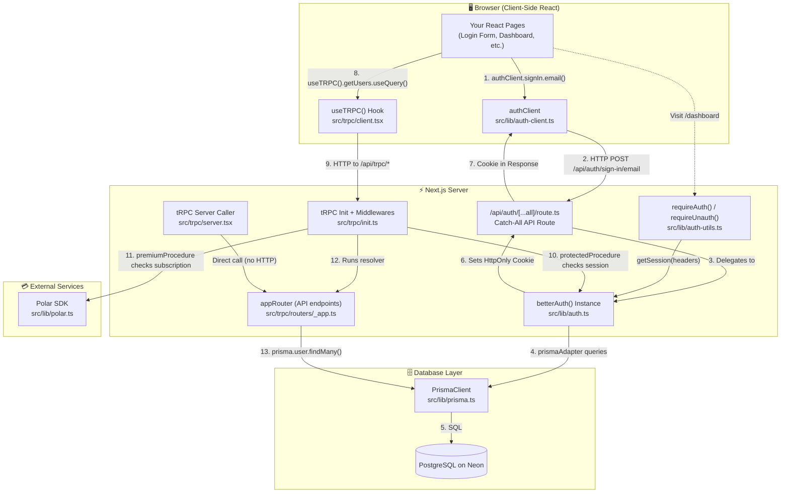

# 🔐 The Ultimate Deep Dive: Authentication & Full-Stack Flow in Your Next.js Project

This document is your **interview bible**. It explains every file, every line, every connection, and every "under the hood" concept in your project's auth + tRPC + Prisma + Zod stack.

---

## 1. The Big Picture — Architecture Flow Diagram



---

## 2. Layer-by-Layer, File-by-File, Line-by-Line

---

### 🟢 LAYER 1: The Database Foundation

---

#### File: [schema.prisma](file:///d:/Collage/n8n-Flow/nodebase/prisma/schema.prisma)
**What it is:** The blueprint of your entire database. Prisma reads this file and generates TypeScript code that lets you talk to PostgreSQL with type-safety.

```prisma
generator client {
  provider = "prisma-client"       // Tells Prisma to generate a TypeScript client
  output   = "../src/generated/prisma"  // WHERE to put the generated code
}

datasource db {
  provider = "postgresql"          // We're using PostgreSQL (hosted on Neon)
}
```

**The 4 tables `better-auth` needs:**

| Table | Purpose | Interview-ready explanation |
|-------|---------|---------------------------|
| `User` | Stores email, name, password hash | "When someone signs up, a row is created here. The [id](file:///d:/Collage/n8n-Flow/nodebase/src/trpc/client.tsx#38-68) is a unique string (not auto-incremented integer). `emailVerified` tracks if they confirmed their email." |
| `Session` | Stores active login sessions | "Each time a user logs in, a session row is created with a random `token`. This token is sent to the browser as an HttpOnly cookie. On every request, the server looks up this token to identify who's making the request." |
| `Account` | Links social logins (Google/GitHub) to a User | "If a user logs in via GitHub, an Account row links the GitHub `accountId` to the internal `userId`. It also stores OAuth tokens (`accessToken`, `refreshToken`) so the app can make API calls on behalf of the user." |
| `Verification` | Email verification & password reset tokens | "When a user clicks 'forgot password', a verification row is created with a random `value` (the token) and an `expiresAt`. The emailed link contains this token. When they click it, we look it up, check it hasn't expired, and allow the reset." |

**Key Prisma annotations:**
- `@id` → This field is the primary key
- `@default(now())` → Auto-set to current timestamp on creation
- `@updatedAt` → Auto-updated every time the row is modified
- `@unique([email])` → No two users can have the same email
- `@@map("user")` → The actual SQL table name is lowercase `user`, not `User`
- `@relation(fields: [userId], references: [id], onDelete: Cascade)` → If a User is deleted, all their Sessions are automatically deleted too

---

#### File: [prisma.ts](file:///d:/Collage/n8n-Flow/nodebase/src/lib/prisma.ts)
**What it is:** Creates a single, reusable database connection.

```typescript
import "dotenv/config";
// ^ Loads your .env file so process.env.DATABASE_URL is available

import { PrismaPg } from "@prisma/adapter-pg";
// ^ A low-level PostgreSQL adapter. Instead of Prisma's default connection
//   pooling, this uses the `pg` npm package directly (needed for Neon serverless)

import { PrismaClient } from "../generated/prisma/client";
// ^ The auto-generated TypeScript client from your schema

const connectionString = `${process.env.DATABASE_URL}`;
// ^ Reads your Neon database URL from .env

const adapter = new PrismaPg({ connectionString });
// ^ Creates a raw PostgreSQL connection using the pg driver

const prisma = new PrismaClient({ adapter });
// ^ Wraps that raw connection in Prisma's type-safe API
//   Now you can do prisma.user.findMany() instead of writing raw SQL

export { prisma };
// ^ Export it so every file in the project shares ONE connection instance
```

> **Interview insight:** "We use a singleton pattern for PrismaClient. If every file created its own `new PrismaClient()`, we'd exhaust the database connection pool. By exporting one instance, all files share the same pool."

---

### 🔵 LAYER 2: The Authentication Engine

---

#### File: [auth.ts](file:///d:/Collage/n8n-Flow/nodebase/src/lib/auth.ts) — ⭐ THE HEART OF EVERYTHING
**What it is:** Initializes the `better-auth` server-side instance. This is the central brain that handles signup, login, logout, session management, and token validation.

```typescript
import { betterAuth } from "better-auth";
// ^ The core library. Think of it like NextAuth but simpler and more modern.

import { prismaAdapter } from "better-auth/adapters/prisma";
// ^ Tells better-auth HOW to store data. It generates the correct SQL queries
//   for creating users, sessions, etc. using YOUR Prisma schema.

import { prisma } from "./prisma";
// ^ Our single PrismaClient instance from the file above

export const auth = betterAuth({
    database: prismaAdapter(prisma, {
        provider: "postgresql",
        // ^ Tells the adapter which SQL dialect to use (PostgreSQL vs MySQL vs SQLite)
    }),
    emailAndPassword: {
        enabled: true,
        // ^ Turns on traditional email + password authentication

        autoSignin: true,
        // ^ After a user registers, they are AUTOMATICALLY logged in
        //   (a session is created immediately, no redirect to login page)

        minPasswordLength: 8,
        // ^ Server-side validation: rejects passwords shorter than 8 chars
        //   This happens BEFORE the password is hashed and stored
    },
});
```

> **Under the hood:** When you call `auth.api.signUpEmail({ email, password })`, here's what happens internally:
> 1. Validates the password length (≥ 8)
> 2. Checks if the email already exists in the `User` table
> 3. Hashes the password using **bcrypt** (one-way hash, can never be reversed)
> 4. Creates a `User` row and an `Account` row (with `providerId: "credential"`)
> 5. Because `autoSignin: true`, it also creates a `Session` row with a random token
> 6. Returns the session token in an **HttpOnly, Secure** cookie

---

#### File: [route.ts](file:///d:/Collage/n8n-Flow/nodebase/src/app/api/auth/%5B...all%5D/route.ts) — THE GATEWAY
**What it is:** The single API route that exposes ALL auth endpoints to the internet.

```typescript
import { auth } from "@/lib/auth";
// ^ Imports our betterAuth instance

import { toNextJsHandler } from "better-auth/next-js";
// ^ A bridge function that converts better-auth's internal request/response
//   format into Next.js App Router's format (Request → Response)

export const { POST, GET } = toNextJsHandler(auth);
// ^ Destructures into two named exports that Next.js requires:
//   - GET: handles GET requests (e.g., GET /api/auth/session)
//   - POST: handles POST requests (e.g., POST /api/auth/sign-in/email)
```

**The `[...all]` folder name is critical.** It's a Next.js **Catch-All Route**:
- `/api/auth/sign-in/email` → caught ✅
- `/api/auth/sign-up/email` → caught ✅
- `/api/auth/sign-out` → caught ✅
- `/api/auth/session` → caught ✅
- `/api/auth/anything/else/here` → caught ✅

All of these are handled by the **same** file. `better-auth` internally routes them to the correct handler based on the URL path.

> **Interview insight:** "Instead of creating 10 separate API routes for login, signup, logout, session check, etc., we use a single Catch-All route. `better-auth` uses convention-based routing internally — it matches the URL path segment after `/api/auth/` to the correct handler function."

---

#### File: [auth-client.ts](file:///d:/Collage/n8n-Flow/nodebase/src/lib/auth-client.ts) — THE FRONTEND SDK
**What it is:** A client-side helper that gives React components easy functions to call the auth API.

```typescript
import { createAuthClient } from "better-auth/react"
// ^ This import is specifically for CLIENT-SIDE React code.
//   It creates hooks and functions that internally call fetch()

export const authClient = createAuthClient({
    baseURL: "http://localhost:3000"
    // ^ Tells the client WHERE the auth API lives.
    //   Every call like authClient.signIn.email() will POST to:
    //   http://localhost:3000/api/auth/sign-in/email
    //
    //   In production, this would be your actual domain.
})
```

**How you use it in a React component:**
```typescript
// In a login form component:
const result = await authClient.signIn.email({
  email: "user@example.com",
  password: "mypassword123"
});
// This sends: POST http://localhost:3000/api/auth/sign-in/email
// Body: { email: "user@example.com", password: "mypassword123" }
// Response: Sets an HttpOnly cookie automatically
```

> **Interview insight:** "The auth client abstracts away all HTTP details. Instead of manually constructing fetch requests with the correct headers, body format, and cookie handling, we call strongly-typed methods like `authClient.signIn.email()`. The client also handles session caching and reactivity."

---

#### File: [auth-utils.ts](file:///d:/Collage/n8n-Flow/nodebase/src/lib/auth-utils.ts) — SERVER-SIDE PAGE GUARDS
**What it is:** Utility functions to protect **Next.js Server Components** (pages rendered on the server).

```typescript
import { headers } from "next/headers";
// ^ Next.js function that reads the incoming HTTP request headers.
//   This is how we access the session cookie on the server.

import { redirect } from "next/navigation";
// ^ Next.js function that performs a server-side HTTP 302 redirect.
//   The page never renders; the browser is sent elsewhere immediately.

import { auth } from "./auth";
// ^ Our betterAuth instance

export const requireAuth = async () => {
  const session = await auth.api.getSession({
    headers: await headers(),
    // ^ Passes the raw HTTP headers (including the Cookie header) to better-auth.
    //   better-auth extracts the session token from the cookie, looks it up in
    //   the Session table, checks if it's expired, and returns the user data.
  });

  if (!session) {
    redirect("/login");
    // ^ No valid session? Redirect to login. The page component NEVER renders.
    //   This is a server-side redirect, so no flash of content.
  }

  return session;
  // ^ If we get here, the user is authenticated. Returns the full session
  //   object containing: { user: { id, email, name, ... }, session: { token, ... } }
};

export const requireUnauth = async () => {
  const session = await auth.api.getSession({
    headers: await headers(),
  });

  if (session) {
    redirect("/");
    // ^ User IS logged in but visiting /login? Send them to homepage.
    //   Prevents logged-in users from seeing the login form.
  }
};
```

**Usage in a page:**
```typescript
// In app/dashboard/page.tsx:
export default async function DashboardPage() {
  const session = await requireAuth(); // Redirects if not logged in
  return <h1>Welcome, {session.user.name}</h1>;
}
```

---

### 🟡 LAYER 3: The tRPC API Layer (where Zod, superjson, and auth all connect)

---

#### What is tRPC? (Interview-ready explanation)

> "tRPC stands for TypeScript Remote Procedure Call. In a traditional REST API, you define endpoints like `GET /api/users`, and the frontend has no idea what shape the response will be. With tRPC, you define a function on the server, and the client can call it **as if it were a local function**, with full TypeScript autocompletion and type checking. There's no code generation step needed — the types are inferred automatically across the network boundary."

#### What is Zod?

> "Zod is a schema validation library. You define a schema like `z.object({ name: z.string(), age: z.number() })`, and Zod can validate that any incoming data matches that shape at runtime. In tRPC, Zod is used for `.input()` validation — ensuring that API requests contain the correct data before any business logic runs."

#### What is superjson?

> "JSON has limitations — it can't serialize `Date` objects, `Map`, `Set`, `BigInt`, `undefined`, etc. `superjson` is a data transformer that extends JSON to support these types. We configure it in tRPC so that when the server returns a `Date` from Prisma, the client receives an actual JavaScript `Date` object, not a string."

---

#### File: [init.ts](file:///d:/Collage/n8n-Flow/nodebase/src/trpc/init.ts) — tRPC SETUP + AUTH MIDDLEWARE
**What it is:** The foundation of the tRPC system. Defines the context, the base procedure, and the authentication/authorization middlewares.

```typescript
import { auth } from '@/lib/auth';
// ^ Our betterAuth instance - used to validate sessions in middlewares

import { polarClient } from '@/lib/polar';
// ^ Polar SDK client - used to check premium subscription status

import { initTRPC, TRPCError } from '@trpc/server';
// ^ initTRPC: factory to create your tRPC instance
//   TRPCError: typed error class (provides proper HTTP status codes)

import { headers } from 'next/headers';
// ^ Next.js headers() to read cookies from incoming requests

import { cache } from 'react';
// ^ React's cache() function: ensures the context factory runs only ONCE
//   per request, even if called multiple times (request-level memoization)

import superjson from "superjson"
// ^ Data transformer for Date, Map, Set, BigInt serialization
```

```typescript
export const createTRPCContext = cache(async () => {
  return { userId: 'user_123' };
  // ^ The "context" is a bag of data available to every tRPC procedure.
  //   Wrapped in cache() so it's only created once per HTTP request.
  //   Currently hardcoded — in a real app, you'd extract the user here.
});
```

```typescript
const t = initTRPC.create({
  transformer: superjson,
  // ^ Configures superjson as the data transformer.
  //   BOTH server (here) and client (client.tsx) must use the same transformer.
  //   If they don't match, you get cryptic serialization errors.
});
```

```typescript
export const createTRPCRouter = t.router;
// ^ Factory function to create routers (groups of API endpoints)

export const createCallerFactory = t.createCallerFactory;
// ^ Creates a "caller" for server-side direct invocation (no HTTP needed)

export const baseProcedure = t.procedure;
// ^ The most basic procedure — NO authentication required.
//   Anyone (logged in or not) can call endpoints using this.
```

**🔒 The `protectedProcedure` middleware — THIS IS WHERE AUTH MEETS tRPC:**

```typescript
export const protectedProcedure = baseProcedure.use(async ({ ctx, next }) => {
  // ^ .use() adds a MIDDLEWARE. This code runs BEFORE the actual API logic.
  //   Think of it as a security guard standing at the door.

  const session = await auth.api.getSession({
    headers: await headers(),
    // ^ Same pattern as auth-utils.ts!
    //   Reads the cookie from the request, validates the session token
    //   against the Session table in the database.
  });

  if (!session) {
    throw new TRPCError({
      code: "UNAUTHORIZED",
      // ^ This maps to HTTP 401. The client receives a typed error.
      message: "Unathorized",
    });
    // ^ No valid session = request is BLOCKED. The actual API logic NEVER runs.
  }

  return next({ ctx: { ...ctx, auth: session } });
  // ^ Session is valid! We:
  //   1. Spread the existing context (...ctx)
  //   2. ADD the session as ctx.auth
  //   3. Call next() to pass control to the actual API logic
  //   
  //   Now every protectedProcedure handler can access ctx.auth.user.id,
  //   ctx.auth.user.email, etc. with full TypeScript type safety.
});
```

**💎 The `premiumProcedure` middleware — LAYERED ON TOP OF protectedProcedure:**

```typescript
export const premiumProcedure = protectedProcedure.use(
  // ^ Notice: this extends protectedProcedure, NOT baseProcedure.
  //   This means the auth check runs FIRST, then this subscription check.
  //   It's like middleware stacking:
  //   Request → protectedProcedure (auth) → premiumProcedure (subscription) → handler

  async ({ ctx, next }) => {
    const customer = await polarClient.customers.getStateExternal({
      externalId: ctx.auth.user.id,
      // ^ Uses the authenticated user's ID (guaranteed to exist because
      //   protectedProcedure already validated the session) to look up
      //   their subscription status in Polar's payment system.
    });

    if (
      !customer.activeSubscriptions ||
      customer.activeSubscriptions.length === 0
    ) {
      throw new TRPCError({
        code: "FORBIDDEN",
        // ^ HTTP 403: "You're authenticated, but you don't have permission."
        //   Different from 401 (UNAUTHORIZED = "who are you?")
        message: "Active subscription required",
      });
    }

    return next({ ctx: { ...ctx, customer } });
    // ^ Subscription valid! Add customer data to context.
    //   Now the handler can access ctx.customer.activeSubscriptions, etc.
  },
);
```

> **Interview insight:** "The middleware chain is: `baseProcedure` → `protectedProcedure` → `premiumProcedure`. Each layer adds more restrictions. `baseProcedure` is public, `protectedProcedure` requires login, and `premiumProcedure` requires both login AND an active paid subscription. This is the **authorization ladder** pattern."

---

#### File: [_app.ts](file:///d:/Collage/n8n-Flow/nodebase/src/trpc/routers/_app.ts) — YOUR API ENDPOINTS
**What it is:** The main router where you define all your tRPC API endpoints (procedures).

```typescript
import { z } from 'zod';
// ^ Zod: runtime schema validation library.
//   Used for .input() validation on procedures (not used in this file yet,
//   but imported for when you add endpoints that accept user input).

import { baseProcedure, createTRPCRouter } from '../init';
// ^ baseProcedure: public (no auth needed)
//   createTRPCRouter: factory to group procedures into a router

import { prisma } from '@/lib/prisma';
// ^ Our database client

export const appRouter = createTRPCRouter({
  getUsers: baseProcedure.query(() => {
    return prisma.user.findMany();
    // ^ A public endpoint (baseProcedure = no auth).
    //   .query() means it's a READ operation (like GET).
    //   Calls Prisma to fetch all users from the database.
    //   The return type is automatically inferred as User[].
  }),

  // EXAMPLE: How you'd add a protected, validated endpoint:
  // createPost: protectedProcedure
  //   .input(z.object({ title: z.string().min(1), body: z.string() }))
  //   .mutation(async ({ ctx, input }) => {
  //     return prisma.post.create({
  //       data: { ...input, authorId: ctx.auth.user.id }
  //     });
  //   }),
});

export type AppRouter = typeof appRouter;
// ^ This is THE MAGIC LINE of tRPC.
//   By exporting the TYPE of the router, the client can import it and
//   get full autocompletion for every procedure, input, and output —
//   WITHOUT generating any client code. Pure TypeScript inference.
```

> **Where Zod fits in:** "Zod would be used in `.input()` to validate request data. For example, `protectedProcedure.input(z.object({ email: z.string().email() }))` ensures the input is a valid email before the handler runs. If validation fails, tRPC automatically returns a 400 Bad Request with detailed error messages."

---

#### File: [client.tsx](file:///d:/Collage/n8n-Flow/nodebase/src/trpc/client.tsx) — CLIENT-SIDE tRPC SETUP
**What it is:** Sets up tRPC + React Query for use in client-side React components.

```typescript
'use client';
// ^ Next.js directive: this file and its exports can ONLY be used in
//   Client Components (components that run in the browser).

import type { QueryClient } from '@tanstack/react-query';
import { QueryClientProvider } from '@tanstack/react-query';
// ^ React Query: manages caching, loading states, background refetching.
//   tRPC uses React Query under the hood for all data fetching.

import { createTRPCClient, httpBatchLink } from '@trpc/client';
// ^ createTRPCClient: creates the client instance
//   httpBatchLink: batches multiple tRPC calls into a single HTTP request
//   (e.g., 3 useQuery calls → 1 HTTP request with 3 operations)

import { createTRPCContext } from '@trpc/tanstack-react-query';
// ^ Creates React hooks (useTRPC) bound to your AppRouter type

import { useState } from 'react';
import superjson from 'superjson';
// ^ MUST match the transformer used on the server (init.ts)

import { makeQueryClient } from './query-client';
import type { AppRouter } from './routers/_app';
// ^ Importing the TYPE only (not the actual code) — this is how
//   the client gains type-safety without importing server code
```

```typescript
export const { TRPCProvider, useTRPC } = createTRPCContext<AppRouter>();
// ^ Creates:
//   - TRPCProvider: React context provider (wraps your app)
//   - useTRPC: the hook you call in components to make API calls
//     e.g., useTRPC().getUsers.useQuery()
```

```typescript
let browserQueryClient: QueryClient;
function getQueryClient() {
  if (typeof window === 'undefined') {
    return makeQueryClient();
    // ^ Server-side rendering: always create a fresh QueryClient
    //   to avoid sharing cache between different users' requests
  }
  if (!browserQueryClient) browserQueryClient = makeQueryClient();
  return browserQueryClient;
  // ^ Browser: reuse the same QueryClient (singleton pattern)
  //   Prevents losing cache when React re-renders
}
```

```typescript
function getUrl() {
  const base = (() => {
    if (typeof window !== 'undefined') return '';
    // ^ In browser: use relative URL (same origin)
    if (process.env.VERCEL_URL) return `https://${process.env.VERCEL_URL}`;
    // ^ On Vercel: use the deployment URL
    return 'http://localhost:3000';
    // ^ Local dev fallback
  })();
  return `${base}/api/trpc`;
  // ^ All tRPC calls go to /api/trpc (this is a Next.js API route)
}
```

```typescript
export function TRPCReactProvider(props) {
  const queryClient = getQueryClient();

  const [trpcClient] = useState(() =>
    createTRPCClient<AppRouter>({
      links: [
        httpBatchLink({
          transformer: superjson,  // Must match server!
          url: getUrl(),
        }),
      ],
    }),
  );
  // ^ useState with initializer: creates the client ONCE and never recreates it.
  //   Even if the component re-renders, the client stays the same.

  return (
    <QueryClientProvider client={queryClient}>
      <TRPCProvider trpcClient={trpcClient} queryClient={queryClient}>
        {props.children}
      </TRPCProvider>
    </QueryClientProvider>
  );
  // ^ Wraps the entire app with both providers:
  //   1. QueryClientProvider: gives React Query access to the cache
  //   2. TRPCProvider: gives useTRPC() access to the tRPC client
}
```

---

#### File: [server.tsx](file:///d:/Collage/n8n-Flow/nodebase/src/trpc/server.tsx) — SERVER-SIDE tRPC CALLER
**What it is:** Allows Server Components to call tRPC procedures **directly** (no HTTP round-trip).

```typescript
import 'server-only';
// ^ This import CRASHES the build if this file is accidentally imported
//   in a Client Component. It's a safety guard — server secrets must
//   never leak to the browser.

import { createTRPCOptionsProxy } from '@trpc/tanstack-react-query';
import { cache } from 'react';
import { createTRPCContext } from './init';
import { makeQueryClient } from './query-client';
import { appRouter } from './routers/_app';

export const getQueryClient = cache(makeQueryClient);
// ^ Memoized per request: ensures one QueryClient per server request

export const trpc = createTRPCOptionsProxy({
  ctx: createTRPCContext,
  router: appRouter,
  queryClient: getQueryClient,
});
// ^ Creates a proxy that lets you prefetch data for Server Components
//   Usage: const options = trpc.getUsers.queryOptions();

import { createCallerFactory } from './init';
export const caller = createCallerFactory(appRouter)(createTRPCContext);
// ^ Creates a DIRECT caller: you can call tRPC procedures like functions.
//   Usage: const users = await caller.getUsers();
//   NO HTTP request is made — it calls the resolver function directly.
```

> **Interview insight:** "There are TWO ways to call tRPC: from the browser using `useTRPC()` (which makes an HTTP request), and from Server Components using `caller` (which calls the function directly on the server, with zero network overhead). This is a major performance optimization."

---

#### File: [query-client.ts](file:///d:/Collage/n8n-Flow/nodebase/src/trpc/query-client.ts) — REACT QUERY CONFIGURATION

```typescript
import { defaultShouldDehydrateQuery, QueryClient } from '@tanstack/react-query';

export function makeQueryClient() {
  return new QueryClient({
    defaultOptions: {
      queries: {
        staleTime: 30 * 1000,
        // ^ Data is considered "fresh" for 30 seconds.
        //   During this time, re-renders won't trigger refetches.
        //   After 30s, the next component mount triggers a background refetch.
      },
      dehydrate: {
        shouldDehydrateQuery: (query) =>
          defaultShouldDehydrateQuery(query) ||
          query.state.status === 'pending',
        // ^ Controls which queries are serialized from server → client.
        //   Also includes "pending" queries (actively loading on server)
        //   so the client can show loading states correctly.
      },
    },
  });
}
```

---

#### File: [polar.ts](file:///d:/Collage/n8n-Flow/nodebase/src/lib/polar.ts) — PAYMENT/SUBSCRIPTION SERVICE

```typescript
import { Polar } from "@polar-sh/sdk";

export const polarClient = new Polar({
  accessToken: process.env.POLAR_ACCESS_TOKEN,
  // ^ API key for authenticating with Polar's servers

  server: process.env.NODE_ENV === "development" ? "sandbox" : "production",
  // ^ In development, uses Polar's sandbox (test payments, no real charges).
  //   In production, uses the real payment system.
});
```

---

## 3. The Complete Request Lifecycle

Here's what happens when a user clicks "Login" and then makes an API call:

### Login Flow (Step-by-step)

| Step | What Happens | Where |
|------|-------------|-------|
| 1 | User fills in email + password and clicks "Login" | React Component |
| 2 | `authClient.signIn.email({ email, password })` is called | [auth-client.ts](file:///d:/Collage/n8n-Flow/nodebase/src/lib/auth-client.ts) |
| 3 | HTTP POST sent to `/api/auth/sign-in/email` with credentials | Browser → Server |
| 4 | `[...all]/route.ts` catches the request, hands it to `better-auth` | [route.ts](file:///d:/Collage/n8n-Flow/nodebase/src/app/api/auth/%5B...all%5D/route.ts) |
| 5 | `better-auth` looks up the email in the `User` table via Prisma | [auth.ts](file:///d:/Collage/n8n-Flow/nodebase/src/lib/auth.ts) → [prisma.ts](file:///d:/Collage/n8n-Flow/nodebase/src/lib/prisma.ts) |
| 6 | Compares the bcrypt hash of the submitted password with the stored hash | `better-auth` internal |
| 7 | If match: creates a new `Session` row with a random token | Database |
| 8 | Returns the token as an **HttpOnly, Secure, SameSite** cookie | HTTP Response |
| 9 | Browser automatically stores the cookie (JS cannot read it) | Browser |

### Protected API Call Flow

| Step | What Happens | Where |
|------|-------------|-------|
| 1 | Component calls `useTRPC().getUsers.useQuery()` | React Component |
| 2 | React Query + tRPC construct an HTTP request to `/api/trpc/getUsers` | [client.tsx](file:///d:/Collage/n8n-Flow/nodebase/src/trpc/client.tsx) |
| 3 | Browser automatically attaches the session cookie | Browser |
| 4 | `protectedProcedure` middleware intercepts the request | [init.ts](file:///d:/Collage/n8n-Flow/nodebase/src/trpc/init.ts) |
| 5 | `auth.api.getSession()` reads the cookie, queries the `Session` table | [auth.ts](file:///d:/Collage/n8n-Flow/nodebase/src/lib/auth.ts) |
| 6 | If valid: attaches `ctx.auth = session` and calls `next()` | [init.ts](file:///d:/Collage/n8n-Flow/nodebase/src/trpc/init.ts) |
| 7 | The actual resolver runs (`prisma.user.findMany()`) | [_app.ts](file:///d:/Collage/n8n-Flow/nodebase/src/trpc/routers/_app.ts) |
| 8 | Prisma queries PostgreSQL and returns the result | Database |
| 9 | `superjson` serializes the response (handling Dates, etc.) | [init.ts](file:///d:/Collage/n8n-Flow/nodebase/src/trpc/init.ts) |
| 10 | React Query caches the result for 30 seconds | [query-client.ts](file:///d:/Collage/n8n-Flow/nodebase/src/trpc/query-client.ts) |

---

## 4. The Complete File Map

```
src/
├── lib/
│   ├── prisma.ts        → Database connection (singleton PrismaClient)
│   ├── auth.ts          → ⭐ betterAuth core (signup, login, sessions)
│   ├── auth-client.ts   → Frontend SDK (authClient.signIn, signOut)
│   ├── auth-utils.ts    → Server page guards (requireAuth, requireUnauth)
│   └── polar.ts         → Payment/subscription SDK
├── trpc/
│   ├── init.ts          → tRPC setup + auth middlewares (protected/premium)
│   ├── client.tsx       → Client-side tRPC + React Query providers
│   ├── server.tsx       → Server-side direct tRPC caller
│   ├── query-client.ts  → React Query cache configuration
│   └── routers/
│       └── _app.ts      → API endpoint definitions (uses Zod for validation)
├── app/
│   └── api/auth/
│       └── [...all]/
│           └── route.ts → Catch-all API route (exposes betterAuth to HTTP)
└── generated/prisma/    → Auto-generated Prisma client (DO NOT EDIT)
```

---

## 5. Your Interview Script

> *"I built a full-stack Next.js 15 app with session-based authentication using `better-auth`, backed by PostgreSQL on Neon via Prisma ORM.*
>
> *The auth system uses a **3-layer architecture**: a Prisma adapter that maps better-auth's User/Session/Account models to PostgreSQL, a central `betterAuth()` instance that handles signup (with bcrypt password hashing), login (with session token generation stored in HttpOnly cookies), and session validation — and a single Next.js Catch-All route at `/api/auth/[...all]` that exposes all auth endpoints automatically.*
>
> *On the client, I use `better-auth`'s React SDK (`createAuthClient`) for type-safe login/signup calls. On the server, utility functions like [requireAuth()](file:///d:/Collage/n8n-Flow/nodebase/src/lib/auth-utils.ts#5-16) check the session cookie in Server Components and redirect unauthenticated users before any HTML is rendered.*
>
> *For the API layer, I use **tRPC** with **three tiers of procedures**: `baseProcedure` (public), `protectedProcedure` (validates the session via better-auth middleware and injects the user into the tRPC context), and `premiumProcedure` (additionally checks Polar subscription status). Input validation is handled by **Zod schemas** on each endpoint, and **superjson** is used as a data transformer so JavaScript `Date` objects from Prisma survive serialization.*
>
> *From Client Components, data is fetched via `useTRPC()` hooks backed by React Query (with 30-second stale times and request batching via `httpBatchLink`). From Server Components, I use a direct `caller` that invokes tRPC procedures without any HTTP overhead — a significant SSR performance optimization."*
